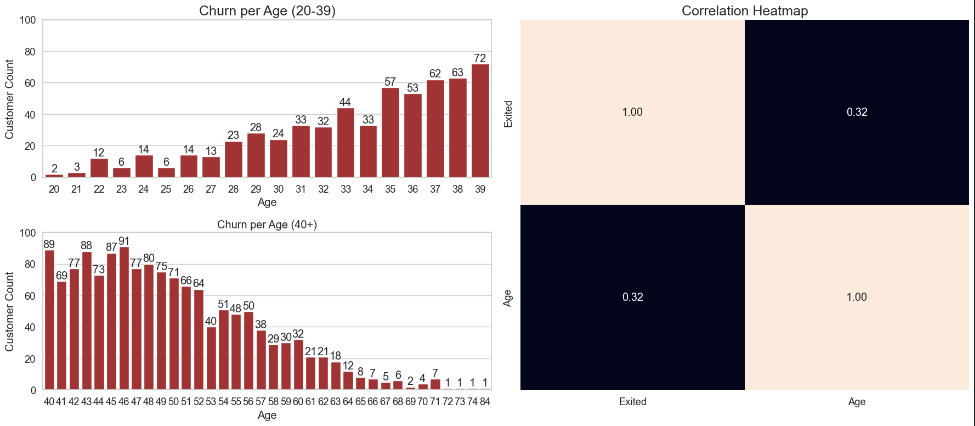
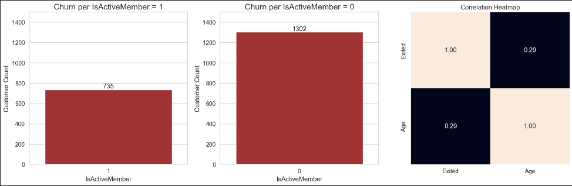
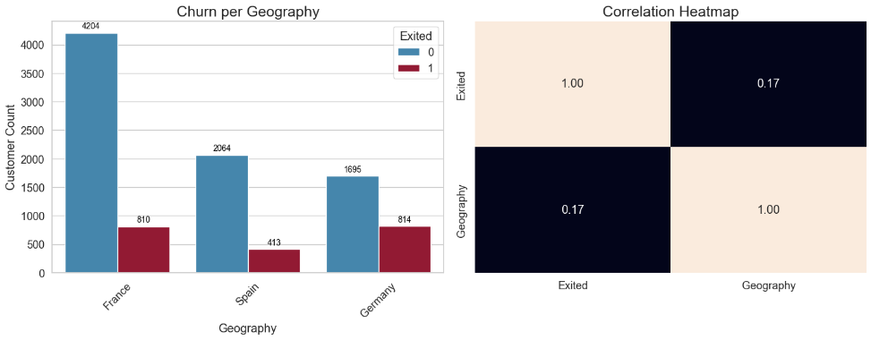

<h1 align="center">
  
</h1>

## 1.0. Introdução ao problema de negócio

O Golden Bank é uma grande empresa de serviços bancários. Ela atua principalmente nos países da Europa oferecendo produtos financeiros, desde contas bancárias até investimentos, passando por alguns tipos de seguros e produto de investimento.

O modelo de negócio da empresa é do tipo serviço, ou seja, ela comercializa serviços bancários para seus clientes através de agências fisicas e um portal online.

O principal produto da empresa é uma conta bancária, na qual o cliente pode depositar seu salário, fazer saques, depósitos e transferencias para outras contas. Essa conta bancária não tem um custo para o cliente e tem uma vigência de 12 meses, ou seja, o cliente precisa renovar o contrato dessa conta para continuar utilizando pelos próximos 12 meses.

Segundo o time de Analytics da Golden Bank, cada cliente que possui essa conta bancária retorno um valor monetário de 15% do valor do seu salário estimado, se esse for menor que a média e 20% se esse salário for acima da média, durante o periodo vigente da sua conta. Esse valor é calculado anualmente.

Por exemplo, se o salário mensal de um cliente é de R$1.000,00 e a média de todos os salários do banco é de R$800,00 a empresa fatura R$200,00 por ano com esse cliente. Se esse cliente está no banco há 10 anos, a empresa já faturou R$2.000,00 com suas transações e utilização da conta.

Nos últimos meses, o time de Analytics percebeu que a taxa de clientes cancelando suas contas e deixando o banco atingiu numeros inéditos na empresa. 

Preocupados com a queda dessa métrica, o time de Analytics da Golden Bank contratou você como consultor de Data Science para criar um plano de ação, com objetivo de reduzir a evasão de clientes, ou seja, impedir que o cliente cancele seu contrato e não o renove por mais 12 meses. Essa evasão, nas métricas de negócio, é conhecida como **Churn**

### 1.1. Questões do negócio

Como um consultor de Ciência de Dados, você precisa criar um plano de ação para diminuir o número de cliente em churn e mostrar o retorno financeiro da sua solução.

Ao final da sua consultoria, você precisa entregar ao CEO do Golden Bank um modelo em produção, que receberá uma base de clientes via API e retornará essa mesma base "scorada", ou seja, uma coluna a mais com a probabilidade de cada cliente entrar em churn.

Além disso, você precisará fornecer um relatório reportando a performance do seu modelo e o impacto financeiro da sua solução. Questões que o CEO e o time de Analytics gostariam de ver em seu relatório:

1. Qual a taxa atual de Churn da Golden Bank? 

2. Qual a performance do modelo em classificar os clientes como **churns**?

3. Qual o retorno esperado, em termos de faturamento, se a empresa utilizar seu modelo para evitar o **churn** dos clientes?

Uma possível ação para evitar que o cliente entre em churn é oferecer um cupom de desconto, ou algum outro incentivo financeiro para ele renovar seu contrato por mais 12 meses.

## 2.0. Planejamento da Solução

### 2.1. Entrega Final

- Planilha no Google Sheets com o rankeamento dos 100 clientes mais propensos ao churn e que receberão o cupom de desconto.

<h1 align="center"></h1>

### 2.2. Ferramentas

- [Python 3.8.15](https://www.python.org/downloads/release/python-3815/)
- [Jupyter Notebook](https://jupyter.org/)
- [Visual Studio Code](https://code.visualstudio.com/)
- [Scikit Learn](https://scikit-learn.org/0.21/documentation.html) and [LGBM Classifier](https://lightgbm.readthedocs.io/en/latest/pythonapi/lightgbm.LGBMClassifier.html)
- Boruta
- [Git](https://git-scm.com/) and [Github](https://github.com/)

### 2.3. Processo até a solução

Iremos utilizar o método CRISP-DS ao longo do projeto, seguindo todas as suas etapas e visando uma primeira entrega mais
rápida porem mantendo uma boa qualidade, posteriormente poderemos voltar para o inicio do ciclo novamente afim de implementar novas tecnicas e melhorias no projeto caso o resultado final ainda não esteja satisfatório.

- **Business Problem:** Etapa em que é feito um pedido ou pergunta por parte do dono do problema.

- **Business Understand:** Entender mais sobre a motivação do CEO por trás da solicitação.

- **Data Collect:** Fazer a coleta dos dados do Golden Bank.

- **Data Cleaning:** Realizar o tratamento dos dados faltantes no nosso conjunto de dados.

- **Data Description:** Entender o quão desafiador é o problema que temos em mãos, conseguiremos responder se temos recursos para trabalhar, quais sãos os tipos de variaveis que temos , qual porcentagem de cada tipo, a quantidade de dados faltantes e a estatistica descritiva dos dados.

- **Feature Engineering:** Derivação de novas features através das originais, que irão nos ajudar na melhoria do modelo de ML, alem de ser parte importante para a validação das hipoteses levantadas e insights para o negócio.

- **EDA:** Entendimento de como as variáveis impactam no fenomeno de vendas, e qual a força desse impacto. Aqui ganhamos experiência do negócio, validaremos as hipoteses levantadas anteriormente e com isso iremos conseguir ter a percepção de quais variáveis são importantes para descrever nosso fenomeno.

- **Data Preparation:** Parte onde os dados são preparados para que possam ser recebidos pelo modelo de ML, dados categóricos e numéricos recebem diferentes tratamentos para que posssam ficar em uma escala numérica próxima.

- **Feature Selection:** Nesta etapa, devemos escolher as features que melhor descrevem o nosso fenomeno, dizemos que estas são as features mais relevantes para o aprendizado do nosso modelo. 

- **Machine Learning Modeling:** Neste projeto, escolhemos os principais algoritmos de Regressão para serem treinados com nossos dados. 

- **Hyperparameter Fine Tunning:** Utilizado a tecnica de Random Search para escolher os melhores parametros para performance do algoritmo escolhido.

- **Avaliação do modelo:** Utilizado as metricas de PRECISION e RECALL para avaliar a performance do modelo.

- **Resultados financeiros:** Tradução do resultado do modelo para um resultado financeiro, tornando fácil o entendimento dos resultados.

## 4.0. Os 4 principais insights do negócio

- ### **H1:** Clientes com somente um produto são os que mais dão churn.
<h1 align="left"></h1>

- ### **H2:** Clientes com idade entre 40 e 50 anos são os que mais dão churn.
<h1 align="left"></h1>

- ### **H3:** Clientes ativos dão menos menos churn do que clientes não ativos.
<h1 align="left"></h1>

- ### **H4:** Na alemanha é onde temos menos clientes e a maior taxa de churn.

<h1 align="left"></h1>

## 5.0. Modelo de Machine Learning

Com nossos dados já tratados e prontos para serem utilizados, escolhemos seis algoritmos de Classificação, onde iremos fazer o treinamento de cada um e o modelo que melhor performar será escolhido para ter seus parametros tunados na etapa seguinte.

- Extra Trees Classifier
- Random Forest Classifier
- XGBoost Classifier
- LGBM Classifier
- Support Vector Machine
- Naive Bayes

### 5.1. Resultado singular

| Model Name | Precision at k | Recall at k |
|------------|----------------|-------------|
|LGBM Classifier			|0.3526|	0.8982|
|Random Forest Classifier	|0.3487|	0.888 |
|ExtraTreesClassifier		|0.3417|	0.8702|
|XGboost Classifier			|0.3387|	0.8626|
|SVM Classifier				|0.3297|	0.8397|
|Naive Bayes Classifier		|0.3297|	0.8397|

### 5.2. Performance Real - Cross Validation Time Series

| Model Name | Precision at k | Recall at k |
|------------|----------------|-------------|
|LGBM Classifier			|0.371|0.909|
|Random Forest Classifier	|0.367|0.902|
|ExtraTreesClassifier		|0.366|0.9+/-0.01|
|XGboost Classifier			|0.36|0.885|
|SVM Classifier				|0.345|0.847|
|Naive Bayes Classifier		|0.342|0.841|

### 5.3. Seleção do modelo

O modelo selecionado foi o LGBM Classifier

- Alta performance
- Treinamento rapido
- Precisão elevada em comparação com outros algoritmos de boosting.

### 5.4. Resultado após ajuste nos hyperparametros do modelo

Aplicado o metodo de **Random Search** para encontrar os melhores hyperparametros para serem usados no treinamento
do LGBM Classifier, o resultado foi o seguinte:

| Model Name | Precision at k | Recall at k |
|------------|----------------|-------------|
|LGBM Classifier			|0.371|0.909|

<h1 align="left"></h1>

## 6.0. Bussiness Results with Knapsack Problem

<h1 align="left"></h1>

Para transformar os resultados do modelo em resultado financeiro para o negócio, foi adotado uma estratégia usando o Knapsack Problem. Imagine que você tem uma mochila que pode carregar até 15kg e quatro itens com diferentes pesos e valores. Seu objetivo é escolher os itens que maximizem o valor total sem ultrapassar o limite de peso. Aplicamos este princípio ao selecionar clientes, onde:

- **Itens:** Clientes

- **Peso**: Custo do incentivo para cada cliente

- **Valor**: Retorno financeiro esperado de cada cliente

- **Limite de Peso**: Orçamento total disponível para incentivos

Isso nos permite otimizar o uso dos recursos da empresa, garantindo o maior retorno financeiro possível.

_Clientes selecionados para receber o gift card segundo o Knapsack_

<h1 align="left"></h1>

### De acordo com o resultado do modelo, tivemos um ROI de **$3,814,277.68**

| CENARIO         | 	VALORES         |
|-----------------|------------------|
| Aleatoriamente | $364,098.65 |
| 100 maiores probabilidades de churn | $926,192.04 | 
| 100 clientes mais ricos | $2,246,466.97 |
| knapsack clients	 | $3,814,277.68 |

## 7.0 Conclusão

1. Qual a taxa atual de Churn da Golden Bank? 
    * **Atualmente a taxa de Churn do Golden Bank é de 20%**

2. Qual a performance do modelo em classificar os clientes como **churns**? 
    * **De 200 clientes selecionados pelo Knapsack para receber o gift card, 61.50% foram classificados corretamente pelo modelo.**

3. Qual o retorno esperado, em termos de faturamento, se a empresa utilizar seu modelo para evitar o **churn** dos clientes
    * Utilizando o modelo, o ROI seria de  **$3,814,277.68**

